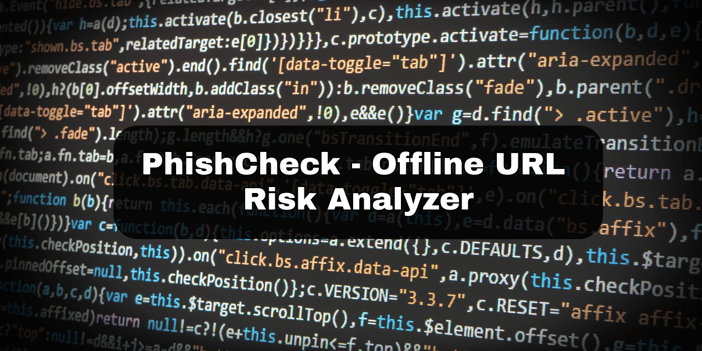

# PhishCheck — Offline URL Risk Analyzer

**Client-side phishing analyzer** built with **HTML/CSS/JavaScript**.  
No servers, no tracking, works **fully offline**. Paste a URL → get a **0–100 risk score**, transparent reasons, and **actionable safety tips**.

**Live demo:** https://Giuseppe552.github.io/phishcheck/

---

## ✨ Features
- Transparent **risk score** (0–100) with color bar + animated counter
- Flags: HTTP, IP-in-URL, “@” trick, many subdomains, heavy encoding
- Detects **punycode/confusables**, shorteners, suspicious TLDs
- **Actionable tips** (not just a score)
- **Privacy-first:** All logic in the browser. No network calls.
- Keyboard accessible + ARIA labels. Dark mode.

---

## 🧠 How it works (short)
- Parses the URL via `URL()` → extracts host, path, query.
- Heuristics add/subtract points (e.g., HTTP +20, too many subdomains +10, punycode +25, shortener +15).
- Shows **Findings** with reasons + links to safety resources.
- Stores theme preference in `localStorage`.

---

## 🧪Future improvements

Browser extension packaging (MV3)

Import/export allowlists/blocklists

Heuristic weights configurable by user

Add unit tests for parser + heuristics
